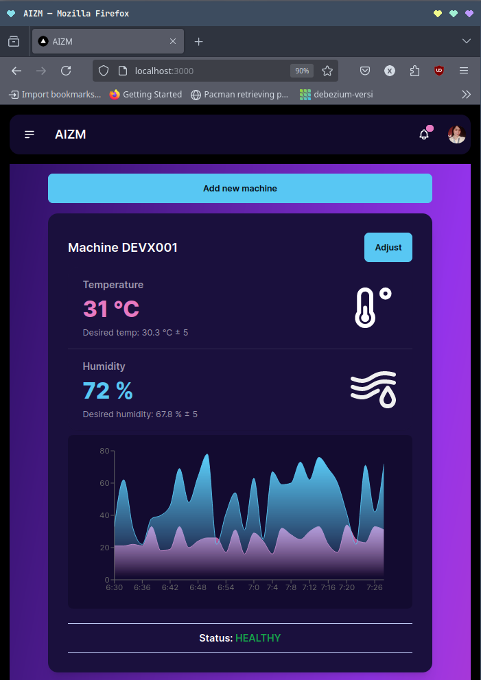
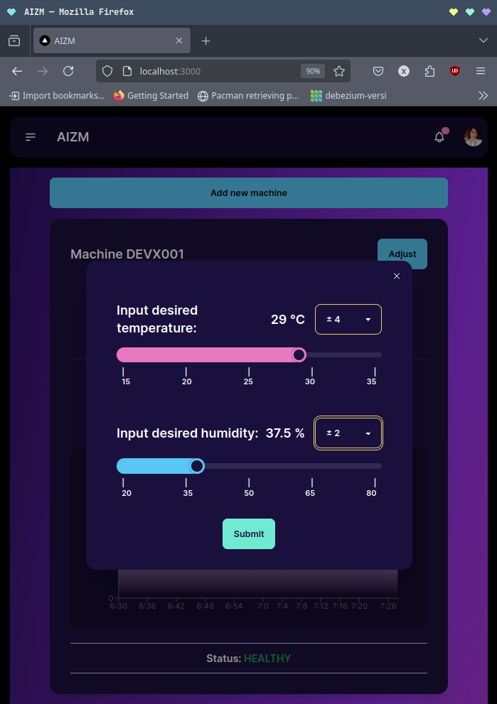
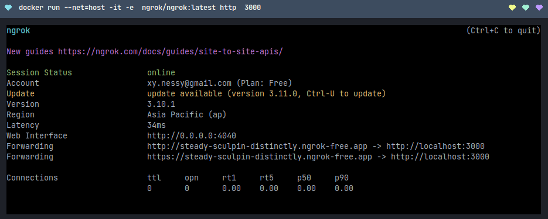
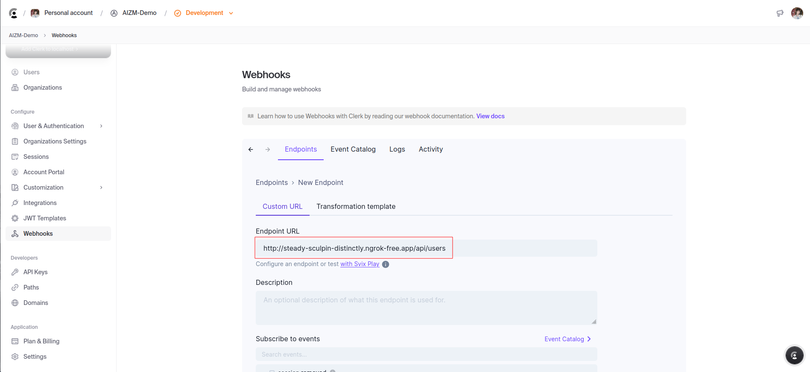
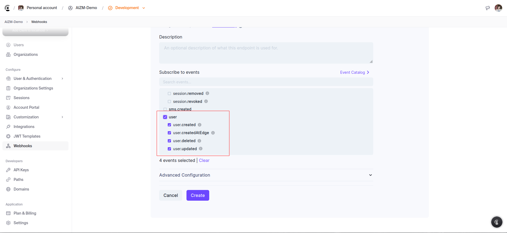

# AZIM Setting and Monitoring System
This web application must run alongside the AIZM hardware machine, whose code and schematic is provided in `/hardware` directory.  

 Website preview           |   Website preview
:-------------------------:|:-------------------------:
  |  

This app uses the following libraries:
- [Clerk](https://clerk.com/)
- [daisyUI](https://daisyui.com/)
- [Drizzle ORM](https://orm.drizzle.team/)
- [MQTT.js](https://github.com/mqttjs/MQTT.js)
- [Recharts](https://recharts.org)

## Development

Run a local instance of [ngrok](https://ngrok.com/) to expose the Next.js app running on http://localhost:3000 to auth webhooks.

 

Create a [Clerk](https://clerk.com/) application. Add the public host provided by `ngrok` and append the `api/users` endpoint. 

 

 

Tick the events related to `user` to receive user events.

 

Copy the API Keys to `.env.local`. Refer to `.env.example` for the required environment variables.

## Database

This application uses [Timescaledb](https://www.timescale.com/). Run a local or docker instance of timescaledb with the schema provided in `./sql/schema.sql`. 

If you want to initialize a seeded dockerized database to see the UI in action, run the following command:

`docker-compose up -d ` 

## Get started

Install the dependencies:

`pnpm install` 

Run in dev mode:

`pnpm dev`

Open the app in browser:

`http://localhost:3000`

